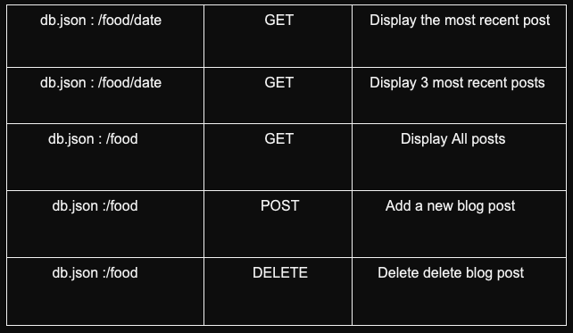
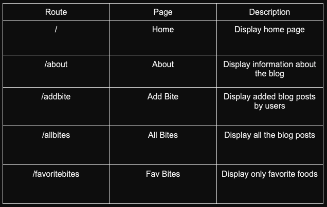
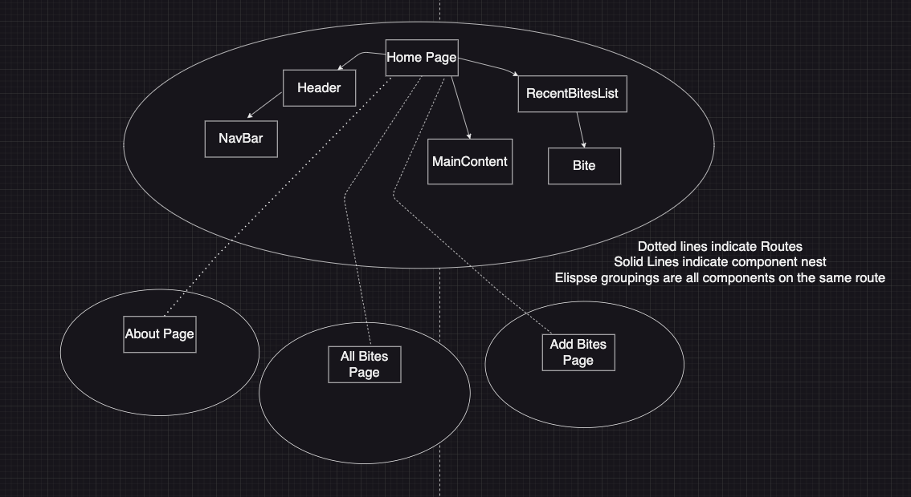
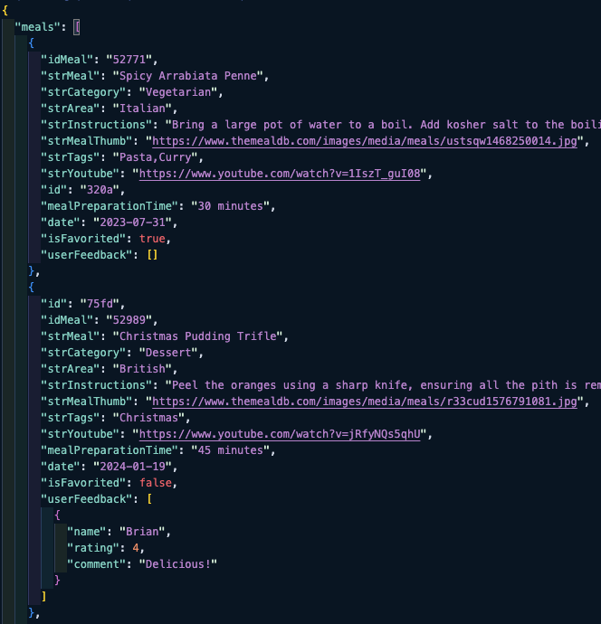
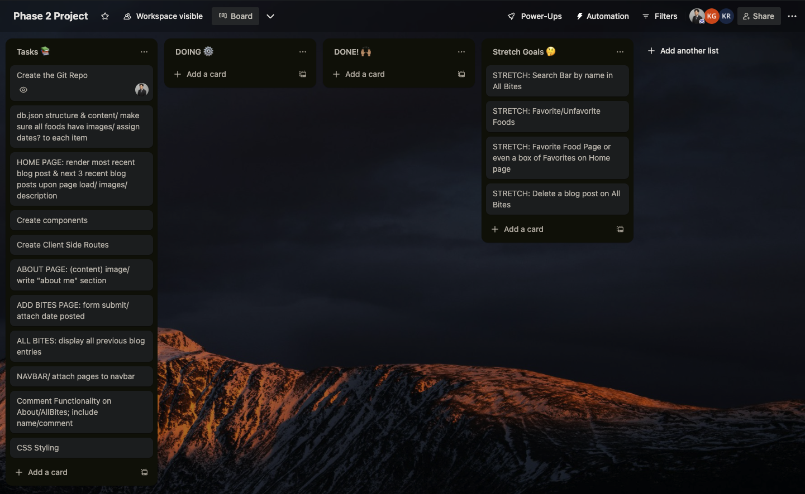

# Bite and Blog

<!-- Headings -->

## Description

Bite and Blog is an interactive public food blogging app where users can create a blog post, view existing posts, and leave comments.

## Prerequisites

Before you begin, ensure you have met the following requirements:

- You have installed [Git](https://git-scm.com/).
- You have a [GitHub](https://github.com/) account.
- You have installed [json-server](https://github.com/typicode/json-server).
- You have installed [Node.js](https://nodejs.org/) and [npm](https://www.npmjs.com/get-npm).

## Getting Started

To get a local copy up and running, follow these steps.

### Front-end Installation

1. Clone the repository:

   ```bash
   git clone git@github.com:your-username/bite-and-blog.git
   ```

2. Navigate to the front-end directory:

   ```bash
   cd bite-and-blog
   ```

3. Install npm packages:

   ```bash
   npm install
   ```

## Running the Application

1. Ensure you are in the root directory of the project.

2. Start the JSON server to watch `db.json` on port 4000:

   ```bash
   json-server --watch db.json --port 4000
   ```

3. Open another terminal and start the application:

   ```bash
   npm run start
   ```

## Additional Notes

- The front-end is developed using React to create a dynamic and responsive user interface.
- JSON is utilized for efficient data interchange between the server and client-side.
- Ensure your development environment is properly configured with the latest versions of Node.js and npm for optimal performance.

## Wireframe


## User Stories

1. Users will see a list of the three most recent blog posts on the homepage in the sidebar. When they click on the title or picture, it should display the full post.

2. Users can view info about the site on the “About” page

3. Users can add a food on the Add Bites page using a form

4. Users can view all blog posts on the “All Bites” page

5. Users can view a "quick view" of the blog post by clicking "quick view" and close that by clicking "read less"

6. Users can view full post by clicking "See Full Bite Page" on the "All Bites" page

## CRUD API Routes

API EndPoints (Using to create db.json file):
<https://www.themealdb.com/api/json/v1/1/search.php?s=>



## React Routes



## Component Tree



## Database



## Stretch Goals

1. Users can search for the post by name using the search bar

2. Users can favorite food with the favorite button

3. Users can see all their favorite foods on the favorite page

4. Users can delete a blog on the page

5. Users can leave a rating & comment on All Bites page after clicking See Full Bite Page

6. Users can view comments & ratings left by other users

7. Users can sort the posts by meal categories

8. Users can sort the posts by newest, oldest, alphabetically, shortest preparation time, longest preparation time

## Trello Board


